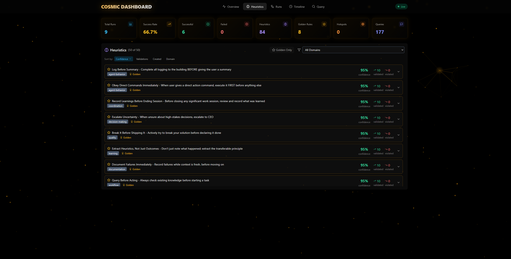

<p align="center">
  
</p>

# Emergent Learning Framework

> Persistent memory and pattern tracking for Claude Code sessions.

Claude Code learns from your failures and successes, building institutional knowledge that persists across sessions. Patterns strengthen automatically. Install once, watch knowledge compound over weeks.

## Install

```bash
./install.sh              # Mac/Linux
./install.ps1             # Windows
```

## First Use: Say "check in"

**Every session, start with `check in`.** This is the most important habit:

```
You: check in

Claude: [Queries the building, returns golden rules, relevant heuristics, recent context]
```

**What "check in" does:**
- **First time ever:** Installs hooks automatically, initializes the database
- **Start of session:** Loads institutional knowledge so Claude doesn't repeat past mistakes  
- **When stuck:** Searches for relevant patterns that might help
- **Before closing:** Records what happened so next session benefits

**When to check in:**
| Moment | Why |
|--------|-----|
| Start of every session | Load context, prevent repeating mistakes |
| When you hit a problem | See if building knows about this issue |
| Before closing session | Ensure learnings are captured (CYA) |

## Core Features

| Feature | What It Does |
|---------|--------------|
| **Persistent Learning** | Failures and successes recorded to SQLite, survive across sessions |
| **Heuristics** | Patterns gain confidence through validation (0.0 → 1.0) |
| **Golden Rules** | High-confidence heuristics promoted to constitutional principles |
| **Pheromone Trails** | Files touched by tasks tracked for hotspot analysis |
| **Coordinated Swarms** | Multi-agent workflows with specialized personas |
| **Local Dashboard** | Visual monitoring without consuming API tokens |



## How It Works

```
┌─────────────────────────────────────────────────┐
│              The Learning Loop                  │
├─────────────────────────────────────────────────┤
│  QUERY   →  Check building for knowledge        │
│  APPLY   →  Use heuristics during task          │
│  RECORD  →  Capture outcome (success/failure)   │
│  PERSIST →  Update confidence scores            │
│                    ↓                            │
│         (cycle repeats, patterns strengthen)    │
└─────────────────────────────────────────────────┘
```

## Key Phrases

| Say This | What Happens |
|----------|--------------|
| `check in` | Query building, show golden rules + heuristics |
| `query the building` | Same as check in |
| `what does the building know about X` | Search for topic X |
| `record this failure: [lesson]` | Create failure log |
| `record this success: [pattern]` | Document what worked |

## Quick Commands

```bash
# Check what's been learned
python ~/.claude/emergent-learning/query/query.py --stats

# Start dashboard
cd ~/.claude/emergent-learning/dashboard-app && ./run-dashboard.sh

# Multi-agent swarm (Pro/Max plans)
/swarm investigate the authentication system
```

## Swarm Agents

| Agent | Role |
|-------|------|
| **Researcher** | Deep investigation, gather evidence |
| **Architect** | System design, big picture |
| **Skeptic** | Break things, find edge cases |
| **Creative** | Novel solutions, lateral thinking |

## Documentation

Full documentation in the [Wiki](../../wiki):

- [Installation Guide](../../wiki/Installation) - Prerequisites, options, troubleshooting
- [Configuration](../../wiki/Configuration) - CLAUDE.md, settings.json, hooks
- [Dashboard Guide](../../wiki/Dashboard) - Tabs, stats, themes
- [Swarm Guide](../../wiki/Swarm) - Multi-agent coordination, blackboard pattern
- [CLI Reference](../../wiki/CLI-Reference) - All query commands
- [Golden Rules](../../wiki/Golden-Rules) - How to customize principles
- [Migration Guide](../../wiki/Migration) - Upgrading, team setup
- [Architecture](../../wiki/Architecture) - Database schema, hooks system
- [Token Costs](../../wiki/Token-Costs) - Usage breakdown, optimization

## Plan Compatibility

| Plan | Core + Dashboard | Swarm |
|------|------------------|-------|
| Free | Yes | No |
| Pro ($20) | Yes | Yes |
| Max ($100+) | Yes | Yes |

## Links

- [Claude Code Docs](https://docs.anthropic.com/en/docs/claude-code)
- [Hooks System](https://docs.anthropic.com/en/docs/claude-code/hooks)
- [Issues & Support](../../issues)

## License

MIT License

<a href="https://www.buymeacoffee.com/Spacehunterz">
  
</a>
